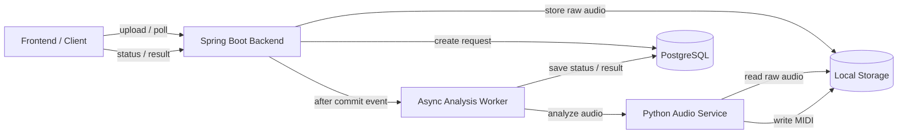
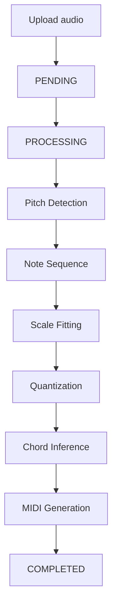
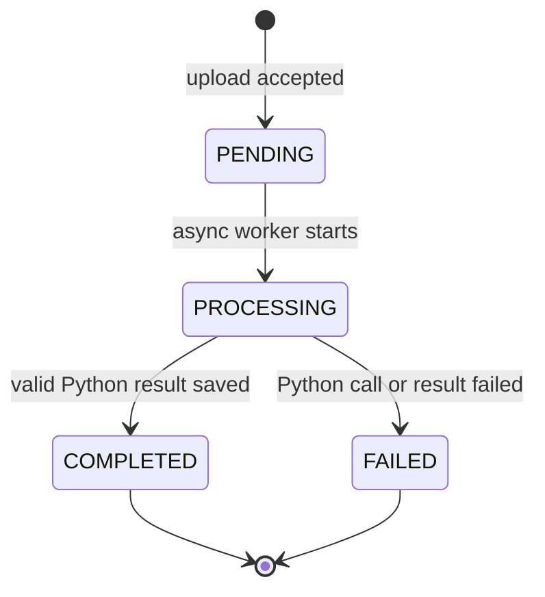
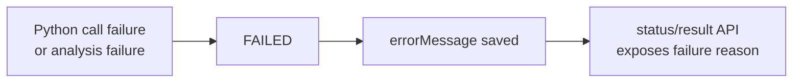

# HumTune

HumTune은 짧은 허밍을 분석해 멜로디 아이디어를 정리하고, 어울리는 코드와 MIDI 반주 결과를 만들어 주는 음악 아이디어 탐색 도구입니다.

AI가 음악을 대신 작곡하는 서비스가 아닙니다.
음정 정리, 스케일/코드 판단, MIDI 생성은 deterministic pipeline이 담당하고, AI는 분석 결과를 바탕으로 멜로디의 분위기와 확장 방향을 설명합니다.

이 저장소는 업로드 API, 분석 상태 관리, Python Audio Service orchestration, 결과 저장/조회를 담당하는 Spring Boot 백엔드입니다.

## Preview

https://github.com/user-attachments/assets/9276d80b-cae5-477c-8cca-6e4038340578

## 사용자 흐름

1. 허밍 오디오를 업로드합니다.
2. HumTune이 멜로디를 정리하고 스케일/코드를 분석합니다.
3. MIDI와 preview audio로 결과를 들어봅니다.
4. AI가 멜로디의 인상, 반복 패턴, 코드와의 어울림, 확장 방향을 설명합니다.

## 핵심 기능

- 허밍 업로드 및 비동기 분석
- Basic Pitch 기반 note 추출
- deterministic cleanup, scale fitting, quantization
- chord inference 및 MIDI/preview 생성
- 분석 결과 기반 AI melody interpretation
- 상태 polling 및 결과 API 제공

## HumTune이 아닌 것

- AI 음악 생성 서비스가 아닙니다.
- 보컬 트레이닝 도구가 아닙니다.
- 노래 실력 평가 서비스가 아닙니다.
- AI가 scale, chord, note, MIDI를 결정하지 않습니다.

## AI와 Deterministic 역할

Deterministic pipeline:

- pitch detection
- note cleanup
- scale fitting
- quantization
- chord inference
- MIDI/preview 생성

AI feedback:

- 멜로디의 분위기와 음악적 인상 설명
- 반복 모티프나 음역 흐름 해석
- 코드 진행과의 어울림 설명
- 편곡/작곡 확장 방향 제안

AI는 분석 결과를 설명할 뿐, 멜로디·코드·스케일·노트를 수정하지 않습니다.

## 아키텍처 요약



## 분석 파이프라인



이 파이프라인은 동일 입력에 대해 동일 결과를 목표로 합니다. scale/chord 선택은 규칙과 tie-break 기준으로 결정되며, MIDI 생성도 시스템 코드가 수행합니다.

## 비동기 처리 흐름

`POST /api/audio`는 분석 완료를 기다리지 않습니다. 업로드 요청은 `PENDING` 상태를 만든 뒤 바로 응답하고, 분석은 worker가 이어서 처리합니다.



실패 흐름:



Spring은 Python 호출 실패, timeout, HTTP 오류, 필수 결과 누락을 `FAILED`로 저장합니다. 클라이언트는 상태/결과 API를 polling하면서 실패 사유를 확인합니다.

## 도메인 모델

- `AudioMeta`: 원본 파일명, content type, 파일 크기, raw audio path, 생성 시각
- `AnalysisRequest`: 분석 요청 상태, 요청/시작/완료/실패 시각, 오류 메시지
- `AnalysisResult`: detected scale, confidence, raw/final notes JSON, chord label sequence JSON, melody metrics JSON, feedback evidence JSON, MIDI path, preview audio path, processing time, 설명/피드백용 `feedbackText`, `chordExplanation`, `naturalnessScore`

## API 요약

### `POST /api/audio`

오디오 파일을 업로드하고 분석 요청을 생성합니다.

- Request: `multipart/form-data`
- Field: `file`
- Success: `201 Created`

```json
{
  "audioId": 1,
  "analysisId": 1,
  "status": "PENDING"
}
```

### `GET /api/audio/{audioId}`

현재 분석 상태를 조회합니다.

```json
{
  "audioId": 1,
  "filename": "sample.wav",
  "status": "PROCESSING",
  "createdAt": "2026-05-12T00:00:00Z",
  "errorMessage": null
}
```

### `GET /api/audio/{audioId}/result`

분석 결과를 조회합니다. 완료 전에는 결과 필드가 `null`로 반환됩니다.

필드 의미:

- `midiPath`: 최종 산출물 MIDI 파일 경로입니다.
- `adjustedNotes`: 최종 quantized melody notes입니다. 기존 API 호환을 위해 필드명은 유지합니다.
- `originalNotes`: Basic Pitch raw notes입니다. 진단/호환용이며 주 산출물은 아닙니다.
- `chords`: chord label sequence입니다. chord timing은 MIDI 파일에 반영되며 API 필드로 노출하지 않습니다.
- `melodyMetrics`: deterministic 품질 지표입니다.
- `feedbackEvidence`: deterministic 피드백 근거입니다.
- `feedbackText`: deterministic 결과를 바탕으로 생성한 멜로디 해석입니다. AI 호출 실패 또는 미설정 시 fallback 문구를 반환합니다.

```json
{
  "audioId": 1,
  "status": "COMPLETED",
  "detectedScale": "C major",
  "keyConfidence": 0.92,
  "originalNotes": [{"pitch": 60}],
  "adjustedNotes": [{"pitch": 60}],
  "chords": ["C"],
  "melodyMetrics": {"scaleToneRatio": 0.9},
  "feedbackEvidence": [{"type": "scale"}],
  "midiPath": "storage/midi/sample.mid",
  "previewAudioPath": "storage/midi/sample.wav",
  "processingTimeMs": 1200,
  "feedbackText": "짧게 반복되는 모양이 있어 멜로디가 기억에 남는 훅처럼 작동합니다. 이 반복은 코드 위에서 곡의 중심 아이디어가 될 수 있으므로, 반주는 복잡하게 움직이기보다 모티프가 들릴 공간을 남기는 편이 좋습니다.",
  "errorMessage": null
}
```

### `GET /api/audio/{audioId}/files/preview`

분석 결과의 브라우저 재생용 WAV preview 파일을 반환합니다.

- Success: `200 OK`
- Content-Type: `audio/wav`
- Missing result or file: `404 Not Found`

### `GET /api/audio/{audioId}/files/midi`

분석 결과의 MIDI 파일을 다운로드합니다.

- Success: `200 OK`
- Content-Type: `application/octet-stream`
- Missing result or file: `404 Not Found`

### `GET /health`

서버 상태 확인용 엔드포인트입니다.

## Python Audio Service 계약

Spring worker는 Python Audio Service의 내부 분석 API를 호출합니다.

```text
POST {AUDIO_SERVICE_BASE_URL}/internal/audio/analyze
```

Request:

```json
{
  "audioId": "1",
  "rawAudioPath": "/absolute/path/to/storage/raw/sample.wav",
  "outputDirectory": "/absolute/path/to/storage/midi"
}
```

Success response:

```json
{
  "status": "COMPLETED",
  "detectedScale": "C major",
  "keyConfidence": 0.92,
  "originalNotes": [{"pitch": 60}],
  "adjustedNotes": [{"pitch": 60}],
  "chords": ["C"],
  "melodyMetrics": {"scaleToneRatio": 0.9},
  "feedbackEvidence": [{"type": "scale"}],
  "midiPath": "/absolute/path/to/storage/midi/sample.mid",
  "previewAudioPath": "/absolute/path/to/storage/midi/sample.wav",
  "processingTimeMs": 1200,
  "errorMessage": null
}
```

Failure response:

```json
{
  "status": "FAILED",
  "errorMessage": "reason"
}
```

## 로컬 실행

Requirements:

- Java 21
- Docker
- Python Audio Service running on `http://127.0.0.1:8000`

Start PostgreSQL:

```bash
docker compose up -d postgres
```

Run Spring Boot:

```bash
./gradlew bootRun --args='--spring.profiles.active=local'
```

Run tests:

```bash
./gradlew test
```

Environment variables:

```text
SPRING_DATASOURCE_URL=jdbc:postgresql://localhost:5432/humtune
SPRING_DATASOURCE_USERNAME=humtune
SPRING_DATASOURCE_PASSWORD=humtune
AUDIO_SERVICE_BASE_URL=http://127.0.0.1:8000
AUDIO_SERVICE_CONNECT_TIMEOUT=3s
AUDIO_SERVICE_RESPONSE_TIMEOUT=120s
AI_FEEDBACK_ENABLED=false
GEMINI_API_KEY=
GEMINI_BASE_URL=https://generativelanguage.googleapis.com
GEMINI_MODEL=
GEMINI_GENERATE_CONTENT_PATH=/v1beta/models/{model}:generateContent
GEMINI_CONNECT_TIMEOUT=3s
GEMINI_READ_TIMEOUT=10s
HUMTUNE_CORS_ALLOWED_ORIGINS=http://localhost:5173
HUMTUNE_AUDIO_STORAGE_PATH=storage/raw
HUMTUNE_AUDIO_OUTPUT_DIRECTORY=storage/midi
```

`AI_FEEDBACK_ENABLED=false`이면 Gemini 설정값 없이 deterministic fallback 피드백을 저장합니다. Gemini를 사용할 때도 API key는 환경 변수로만 주입하며 로그에 출력하지 않습니다.

로컬 실행 시 Spring은 프로젝트 루트의 `.env`를 선택적으로 읽습니다. Gemini 호출을 실제로 시도하려면 `.env` 또는 실행 환경에 최소한 아래 값을 설정해야 합니다.

```text
AI_FEEDBACK_ENABLED=true
GEMINI_API_KEY=<your-api-key>
GEMINI_MODEL=<your-gemini-model>
```

터미널에서 직접 실행할 수도 있습니다.

```bash
AI_FEEDBACK_ENABLED=true GEMINI_API_KEY=... GEMINI_MODEL=... ./gradlew bootRun
```

Upload and poll:

```bash
curl -F "file=@sample.wav" http://localhost:8080/api/audio
curl http://localhost:8080/api/audio/1
curl http://localhost:8080/api/audio/1/result
curl -i http://localhost:8080/api/audio/1/files/preview
curl -OJ http://localhost:8080/api/audio/1/files/midi
```

## 실패 처리

- Empty file or non-`audio/*` upload: `400 Bad Request`
- Missing `audioId`: `404 Not Found`
- Python network error: `FAILED`, `Python audio service unavailable`
- Python timeout: `FAILED`, `Python audio service timed out`
- Python HTTP/client error: `FAILED`, normalized error message
- Python response missing required fields: `FAILED`

오디오 분석 내부 fallback은 Python Audio Service 책임입니다. Spring은 Python 응답이 계약을 만족하는지 검증하고 상태와 오류 메시지를 저장합니다.

## 기술적 선택

- 비동기 분석: 업로드 응답 시간을 Python 처리 시간과 분리합니다.
- 상태 중심 모델: polling 기반 MVP에서 클라이언트 흐름을 단순하게 유지합니다.
- Spring/Python 분리: 상태와 트랜잭션은 Spring이, 오디오 처리는 Python이 담당합니다.
- 규칙 기반 처리: 재현 가능한 결과와 테스트 가능한 선택 기준을 우선합니다.
- JSON 결과 저장: notes/chords 구조 변경 가능성을 고려해 JSONB로 저장합니다.
- Local storage: MVP에서는 파일 경로를 DB에 저장하고 실제 파일은 로컬에 둡니다.
- AI 역할 제한: AI는 멜로디 해석과 작곡 방향 설명만 담당하며, 핵심 음악 결과를 생성하지 않습니다.

## 향후 방향

- 더 다양한 멜로디 구조 해석
- 코드 진행 설명 고도화
- preview 품질 개선
- 파일 수명 관리 및 object storage 연동
- 사용자별 결과 히스토리

## 현재 제한

- Python Audio Service는 별도로 실행되어야 합니다.
- 파일 저장소는 로컬 디렉터리 기준입니다.
- 결과 조회는 polling 방식입니다.
- 인증, 권한, 파일 수명 관리, object storage 연동은 MVP 범위 밖입니다.
