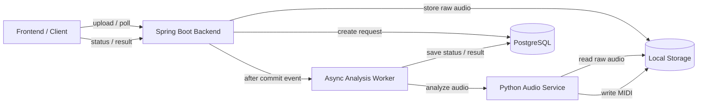
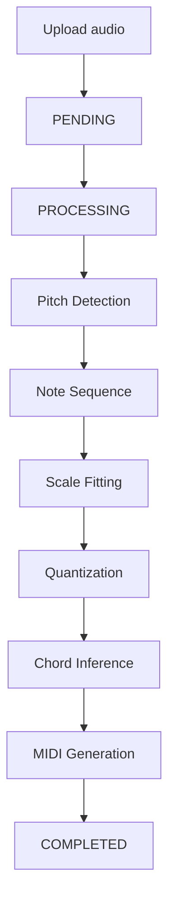
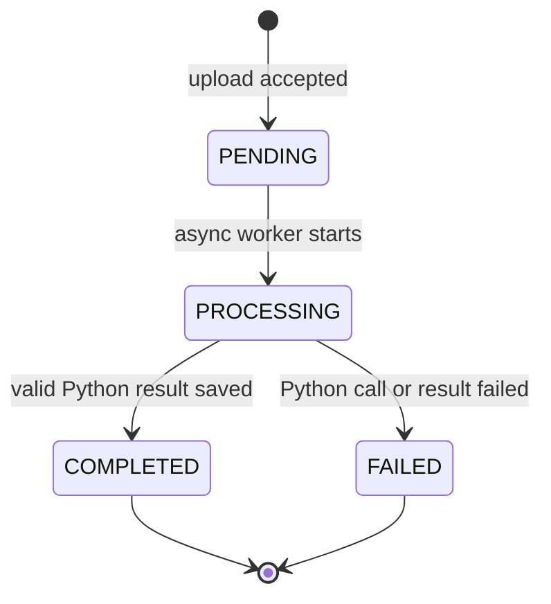
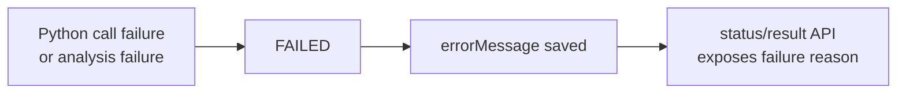

# HumTune Backend

HumTune은 사용자가 짧게 녹음한 허밍을 분석해 보정된 멜로디, 코드 진행, MIDI 결과를 만드는 MVP입니다.
이 저장소는 업로드 API, 분석 상태 관리, 비동기 처리, 결과 저장/조회를 담당하는 Spring Boot 백엔드입니다.

핵심 설계는 단순합니다.

- 음악 판단은 AI가 아니라 deterministic rule-based pipeline이 수행합니다.
- Spring Boot는 요청 흐름, 상태, 저장, Python 호출을 관리합니다.
- Python Audio Service는 오디오/음악 처리만 담당합니다.
- AI는 결과 생성이 아니라 설명과 피드백 보조 역할로 제한합니다.

## MVP 범위

포함:

- 5~10초 허밍 오디오 업로드
- 비동기 분석 요청 처리
- pitch detection, note sequence 변환, scale fitting, quantization
- chord inference, MIDI generation
- 상태 조회 및 결과 조회
- PostgreSQL 기반 메타데이터/상태/결과 저장

제외:

- 완성곡 생성
- 보컬 합성
- 다중 악기 편곡
- 실시간 처리
- AI 기반 핵심 음악 결정
- 운영 인프라 자동화

## System Architecture



책임 분리:

- Spring Boot: 업로드 검증, 파일 저장 경로 관리, `AnalysisRequest` 상태 전이, 비동기 worker 실행, Python 호출, 결과 저장/조회
- Python Audio Service: 오디오 읽기, pitch 추출, note 변환, scale/chord 계산, MIDI 생성
- PostgreSQL: `audio_meta`, `analysis_request`, `analysis_result` 저장
- Local Storage: 원본 오디오와 생성된 MIDI 파일 저장

이 구조는 오디오 처리에 적합한 Python 영역과, API/트랜잭션/상태 관리에 적합한 Spring 영역을 분리하기 위한 선택입니다.

## Audio Analysis Pipeline



이 파이프라인은 동일 입력에 대해 동일 결과를 목표로 합니다. scale/chord 선택은 규칙과 tie-break 기준으로 결정되며, MIDI 생성도 시스템 코드가 수행합니다.

AI가 하지 않는 일:

- pitch 추출
- 음정/박자 보정
- scale/chord 단독 결정
- MIDI 생성

AI가 할 수 있는 일:

- 결과 설명
- 사용자 피드백 문장 생성
- 생성 결과의 자연스러움 평가
- 애매한 후보에 대한 보조 평가

## Async Status Flow

`POST /api/audio`는 분석 완료를 기다리지 않습니다. 업로드 요청은 `PENDING` 상태를 만든 뒤 바로 응답하고, 분석은 worker가 이어서 처리합니다.



실패 흐름:



Spring은 Python 호출 실패, timeout, HTTP 오류, 필수 결과 누락을 `FAILED`로 저장합니다. 클라이언트는 상태/결과 API를 polling하면서 실패 사유를 확인합니다.

## Domain Model

- `AudioMeta`: 원본 파일명, content type, 파일 크기, raw audio path, 생성 시각
- `AnalysisRequest`: 분석 요청 상태, 요청/시작/완료/실패 시각, 오류 메시지
- `AnalysisResult`: detected scale, confidence, original/adjusted notes JSON, chords JSON, MIDI path, preview audio path, processing time, 설명/피드백용 `feedbackText`, `chordExplanation`, `naturalnessScore`

## API Summary

### `POST /api/audio`

오디오 파일을 업로드하고 분석 요청을 생성합니다.

- Request: `multipart/form-data`
- Field: `file`
- Success: `201 Created`

```json
{
  "audioId": 1,
  "analysisId": 1,
  "status": "PENDING"
}
```

### `GET /api/audio/{audioId}`

현재 분석 상태를 조회합니다.

```json
{
  "audioId": 1,
  "filename": "sample.wav",
  "status": "PROCESSING",
  "createdAt": "2026-05-12T00:00:00Z",
  "errorMessage": null
}
```

### `GET /api/audio/{audioId}/result`

분석 결과를 조회합니다. 완료 전에는 결과 필드가 `null`로 반환됩니다.

```json
{
  "audioId": 1,
  "status": "COMPLETED",
  "detectedScale": "C major",
  "keyConfidence": 0.92,
  "originalNotes": [],
  "adjustedNotes": [],
  "chords": [],
  "midiPath": "storage/midi/sample.mid",
  "previewAudioPath": "storage/midi/sample.wav",
  "processingTimeMs": 1200,
  "errorMessage": null
}
```

### `GET /api/audio/{audioId}/files/preview`

분석 결과의 브라우저 재생용 WAV preview 파일을 반환합니다.

- Success: `200 OK`
- Content-Type: `audio/wav`
- Missing result or file: `404 Not Found`

### `GET /api/audio/{audioId}/files/midi`

분석 결과의 MIDI 파일을 다운로드합니다.

- Success: `200 OK`
- Content-Type: `application/octet-stream`
- Missing result or file: `404 Not Found`

### `GET /health`

서버 상태 확인용 엔드포인트입니다.

## Python Audio Service Contract

Spring worker는 Python Audio Service의 내부 분석 API를 호출합니다.

```text
POST {AUDIO_SERVICE_BASE_URL}/internal/audio/analyze
```

Request:

```json
{
  "audioId": "1",
  "rawAudioPath": "/absolute/path/to/storage/raw/sample.wav",
  "outputDirectory": "/absolute/path/to/storage/midi"
}
```

Success response:

```json
{
  "status": "COMPLETED",
  "detectedScale": "C major",
  "keyConfidence": 0.92,
  "originalNotes": [],
  "adjustedNotes": [],
  "chords": [],
  "midiPath": "/absolute/path/to/storage/midi/sample.mid",
  "previewAudioPath": "/absolute/path/to/storage/midi/sample.wav",
  "processingTimeMs": 1200,
  "errorMessage": null
}
```

Failure response:

```json
{
  "status": "FAILED",
  "errorMessage": "reason"
}
```

## Local Run

Requirements:

- Java 21
- Docker
- Python Audio Service running on `http://127.0.0.1:8000`

Start PostgreSQL:

```bash
docker compose up -d postgres
```

Run Spring Boot:

```bash
./gradlew bootRun --args='--spring.profiles.active=local'
```

Run tests:

```bash
./gradlew test
```

Environment variables:

```text
SPRING_DATASOURCE_URL=jdbc:postgresql://localhost:5432/humtune
SPRING_DATASOURCE_USERNAME=humtune
SPRING_DATASOURCE_PASSWORD=humtune
AUDIO_SERVICE_BASE_URL=http://127.0.0.1:8000
HUMTUNE_CORS_ALLOWED_ORIGINS=http://localhost:5173
HUMTUNE_AUDIO_STORAGE_PATH=storage/raw
HUMTUNE_AUDIO_OUTPUT_DIRECTORY=storage/midi
```

Upload and poll:

```bash
curl -F "file=@sample.wav" http://localhost:8080/api/audio
curl http://localhost:8080/api/audio/1
curl http://localhost:8080/api/audio/1/result
curl -i http://localhost:8080/api/audio/1/files/preview
curl -OJ http://localhost:8080/api/audio/1/files/midi
```

## Failure Handling

- Empty file or non-`audio/*` upload: `400 Bad Request`
- Missing `audioId`: `404 Not Found`
- Python network error: `FAILED`, `Python audio service unavailable`
- Python timeout: `FAILED`, `Python audio service timed out`
- Python HTTP/client error: `FAILED`, normalized error message
- Python response missing required fields: `FAILED`

오디오 분석 내부 fallback은 Python Audio Service 책임입니다. Spring은 Python 응답이 계약을 만족하는지 검증하고 상태와 오류 메시지를 저장합니다.

## Technical Decisions

- 비동기 분석: 업로드 응답 시간을 Python 처리 시간과 분리합니다.
- 상태 중심 모델: polling 기반 MVP에서 클라이언트 흐름을 단순하게 유지합니다.
- Spring/Python 분리: 상태와 트랜잭션은 Spring이, 오디오 처리는 Python이 담당합니다.
- 규칙 기반 처리: 재현 가능한 결과와 테스트 가능한 선택 기준을 우선합니다.
- JSON 결과 저장: notes/chords 구조 변경 가능성을 고려해 JSONB로 저장합니다.
- Local storage: MVP에서는 파일 경로를 DB에 저장하고 실제 파일은 로컬에 둡니다.
- AI 역할 제한: AI는 설명/피드백 보조이며, 핵심 음악 결과를 생성하지 않습니다.

## Known Limitations

- Python Audio Service는 별도로 실행되어야 합니다.
- 파일 저장소는 로컬 디렉터리 기준입니다.
- 결과 조회는 polling 방식입니다.
- 인증, 권한, 파일 수명 관리, object storage 연동은 MVP 범위 밖입니다.
